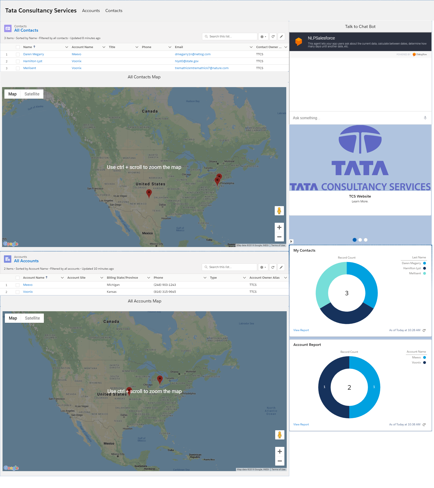

# GoogleHomeToSalesforce

This salesforce application is set up to allow for Dialogflow to run within salesforce

# UI

# Features

- Currently this bot allows for creating of contacts and accounts. 
- After creation of a contact, on the home page map. Accounts and contacts show up in their respected locations

# Stack
## Chat Bot Stack:
- Firebase
- Node.js
- Dialog Flow

## Salesforce
- Lightning Components
- Apex classes

## Developers
- Riley Griffin
  -- Training ML model for chat bot
  -- Creating ML Model for chat bot
  -- Creating all Lightnining Components
  
